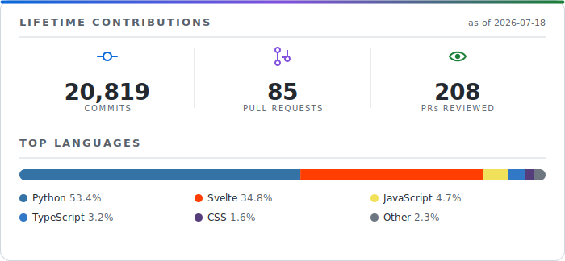

# Empowering researchers in metabolic modeling

...to make work easier, faster and more reproducible

Computational Systems Biology, RWTH Aachen

## Stats

<picture>
  <source media="(prefers-color-scheme: dark)" srcset="assets/stats-dark.svg">
  <source media="(prefers-color-scheme: light)" srcset="assets/stats-light.svg">
  
</picture>

## Projects

### Computational Biology (CPBL) Projects

| Project                                                                                                                                                                                                                                                                                                                                                   | Description                                                                                    |
| --------------------------------------------------------------------------------------------------------------------------------------------------------------------------------------------------------------------------------------------------------------------------------------------------------------------------------------------------------- | ---------------------------------------------------------------------------------------------- |
| **[MxlPy](https://github.com/Computational-Biology-Aachen/MxlPy)**                                   | Easily build mechanistic learning models                                                       |
| **[MxlModels](https://github.com/Computational-Biology-Aachen/mxl-models)**                | Python package of reference mechanistic models                                                 |
| **[MxlBricks](https://github.com/Computational-Biology-Aachen/mxl-bricks)**                | Combine reaction bricks to quickly build larger models                                         |
| **[MxlWeb](https://github.com/Computational-Biology-Aachen/mxl-web)**                            | Experimental toolbox to run ODE models in the browser                                          |
| **[GreenSloth](https://github.com/Computational-Biology-Aachen/green-sloth)**            | Interactive, client-side explorer for photosynthesis ODE models                                |
| **[PySBML](https://github.com/Computational-Biology-Aachen/pysbml)**                               | Make SBML models simpler                                                                       |
| **[absorpig](https://github.com/Computational-Biology-Aachen/absorpig)**                       | Extract **pig**ment composition of measured **absor**ption spectra of photosynthetic organisms |
| **[CpblDesign](https://github.com/Computational-Biology-Aachen/design)**                           | CPBL corporate design                                                                          |
| **[Parameteriser](https://github.com/Computational-Biology-Aachen/parameteriser)**   | Interface parameter databases like BRENDA for kinetic model parameterisation                   |

### Personal Projects & Tools

| Project                                                                                                                                                                                                                                                                                                                                        | Description                                                                                                         |
| ---------------------------------------------------------------------------------------------------------------------------------------------------------------------------------------------------------------------------------------------------------------------------------------------------------------------------------------------- | ------------------------------------------------------------------------------------------------------------------- |
| **[modelbase](https://gitlab.com/qtb-hhu/modelbase-software)**                                        | Build & simulate metabolic networks including isotope-labelled versions                                             |
| **[qtbmodels](https://gitlab.com/marvin.vanaalst/qtbmodels)**                                           | Precursor to MxlBricks                                                                                              |
| **[moped](https://gitlab.com/qtb-hhu/moped)**                                                                                   | Integrative hub for reproducible construction, modification, curation and analysis of genome-scale metabolic models |
| **[dismo](https://gitlab.com/qtb-hhu/dismo)**                                                                                   | Build and analysing discrete spatial models based on ordinary differential equations                                |
| **[matplotlib cookbook](https://gitlab.com/marvin.vanaalst/matplotlib-cookbook)**   | Small collection of recipes for matplotlib                                                                          |
| **[difai](https://gitlab.com/marvin.vanaalst/difai)**                                                           | Did I forget any imports? updates your requirements file                                                            |
| **[hue sunrise](https://gitlab.com/marvin.vanaalst/hue-sunrise)**                                   | Enjoy waking up more gently by having your philips hue lights simulate a sunrise                                    |
| **cycparser** [py](https://gitlab.com/qtb-hhu/cycparser-py) & [rs](https://gitlab.com/qtb-hhu/cycparser-rs)       | Parse [MetaCyc](https://metacyc.org/), [BioCyc](https://biocyc.org/) or some other \*cyc flatfiles                  |
